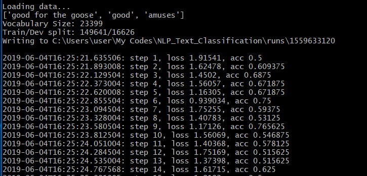

# CNN을 이용한 자연어 처리에 기반한 영화 평론 데이터에서의 감성 인식 
**각종 사이트** 에서 수집한 positive, negative가 레이블되어 있는 문장 데이터 약 30만 개를 학습 시키고 
**영어 말뭉치**에서 nltk 라이브러리를 통해 단어 단위로 전처리 된 '로튼 토마토 영화 리뷰' 데이터를 **CNN 모델**을 통해 긍정, 부정을 분류하는 프로젝트

## 1. Model Structure

      출처 : http://www.wildml.com/2015/12/implementing-a-cnn-for-text-classification-in-tensorflow/

1. 정답 레이블이 있는 '로튼 토마토 영화 리뷰' 데이터 17만 문장에 대해서 **데이터 전처리**

2. 전체 말 뭉치에 있는 단어를 정규화 시켜 벡터로 표현

3. 표현된 단어들과 정답 레이블(0 : negative, 1 : positive) 을 **CNN**에 넣어서 양쪽 끝 state들에 대해서 **fully connected layer**와 **Softmax**함수를 이용해 분류

## 2. Requirement
- [BeautifulSoup 4](https://www.crummy.com/software/BeautifulSoup/bs4/doc/)
- [nltk](https://datascienceschool.net/view-notebook/118731eec74b4ad3bdd2f89bab077e1b/)
- [tensorflow 1.13.1](https://www.tensorflow.org/)

## 3. Data Sets

- 다양한 구조에 따라 정확한 결과를 내는 모델을 만들기 위해 하나의 문장을 여러 개의 chunk로 분류하여 CNN 모델에 학습시키는 방법을 취함. 감성을 포함하지 않은 I, ate, yesterday는 되도록 제외 하는 방향으로 진행
  
ex) sentence : I ate an nice apple yesterday. 1
     
    chunk1 : ate an nice apple 1
    
    chunk2 : an nice apple yesterday 1
    
    chunk3 : I ate nice apple 1

- Training data : 영화 리뷰 데이터 (-) 117030 [rt-polarity.neg](https://github.com/HyungjinLee/NLP_Text_Classification/tree/master/rt-polaritydata)
                  영화 리뷰 데이터 (+) 48965 [rt-polarity.pos]
(https://github.com/HyungjinLee/NLP_Text_Classification/tree/master/rt-polaritydata)
                  총 리뷰 데이터 = 165995 문장

- Test data : Kaggle 리뷰 데이터 말뭉치 2만 5천 건 (https://www.kaggle.com/iarunava/imdb-movie-reviews-dataset)

## 4. Training

1. NLP_Text_Classification_CNN 폴더를 github로부터 다운로드

2. NLP_Text_Classification_CNN/runs 폴더 생성
이 곳에 트레이닝 된 모델이 저장됨

3. **train.py**로 17만 개의 문장을 각각 전처리 한 단어들에 대해서 CNN 모델 학습 후 모델 저장 (경로 : NLP_Text_Classification_CNN/runs/"timemarking"/checkpoint)

4. **Tensorboard**를 통해 학습 과정 & 결과 시각화 (경로 : NLP_Text_Classification_CNN/runs/"timemarking"/summary/train)

** Training Accuracy & Loss ** 

 

   **9000번의 training step에서 뚜렷한 overfitting은 관찰되지 않음**
   
## 5. Test

      softmax 함수는 각 입력에 따라 결과값의 합을 1로 만들어 주는 함수이며, 긍정, 부정이 나올 확률 표현에 유용함
      위의 함수 식에서, 음수 값 입력이 들어 오면 결과값에 영향이 거의 없다는 것에 기인하여 softmax 입력으로 들어 가기 전 score가 음수일 경우 무시하는 방법을 취함 
- eval.py를 통해 test data에 문장 하나에 대해서 성능 확인 (**91.40%**)
- eval.py에서 training option 설정 : True인 경우 new testset을 검사, False인 경우 직접 입력한 문장에 성능 확인
- eval.py에서 30번째 줄의 NLP_Text_Classification_CNN/runs/"timemarking" 경로를 학습한 모델 경로로 설정해 주어야 함

- eval.kaggle-data.py를 통해 말 뭉치 전체에 대해서 성능 확인(**67.95%**)
- 부정에 편향된 불균등한 데이터 셋 개수(3 : 1), 모호성 극복의 어려움 등의 원인으로 한 문장에 비해 말 뭉치 전체에 대해서는 정확성이 현저히 떨어짐
- 이를 극복하기 위해서는 다양하고 균형 있는 데이터 확보가 필요함

## 6. milestone

-   2019.05.27, positive, negative 비율 1:1로 유지하며 데이터 갯수 1만개에서 17만개로 늘리자 성능 50%에서 63%로 증가
-   2019.06.01, 말뭉치를 문장별로 분류하여 softmax에 넣는 방법을 취하자 성능 63%에서 67%로 증가
-   2019.06.04~, 한쪽으로 치우치지 않은 데이터 셋 개수 확보를 위해 노력중 
